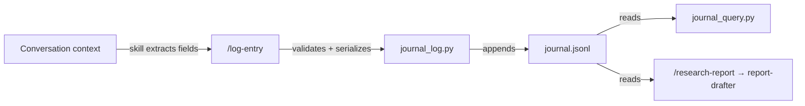
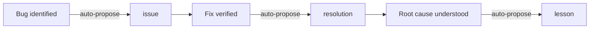
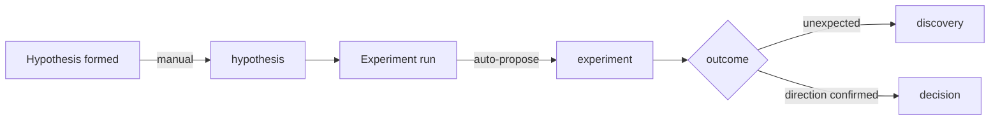
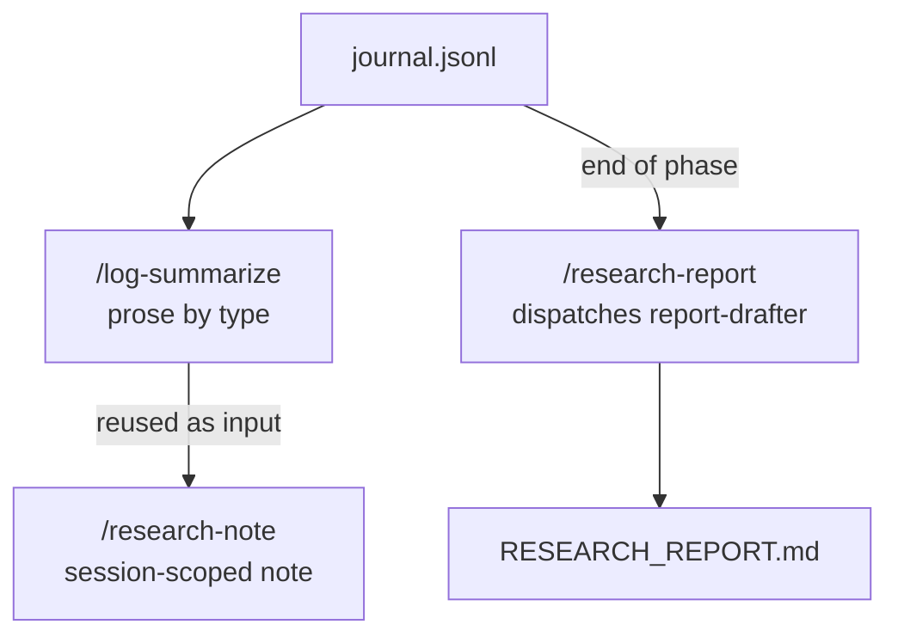

# Architecture

ml-journal is a four-layer system with no background daemons and no external dependencies beyond `python3` and `git`.

## Layer diagram

```
judgment layer     →  Claude skills (extract, classify, construct args)
agent layer        →  Subagents (isolated context ingestion for heavy synthesis)
mechanical layer   →  Python scripts (validate, serialize, write)
storage            →  .project-log/journal.jsonl (per-repo, append-only)
```

## Judgment layer

Claude Code skills (`/log-entry`, `/checkpoint`, `/log-commit`, etc.) handle the parts that require reasoning: extracting the right fields from conversation context, classifying entry types, constructing arguments for the mechanical layer.

## Agent layer

The `report-drafter` agent is dispatched by `/research-report` for heavy synthesis that benefits from isolated context. It reads the full journal, git history, and supplementary docs to produce a 9-section draft. The agent never writes files directly — it returns a draft to the skill for confirmation.

## Mechanical layer

Two stdlib-only Python scripts handle validation and serialization:

- **`journal_log.py`** — validates fields, constructs the envelope (`id`, `timestamp`, `type`, `project`, `session_id`), appends to `journal.jsonl`
- **`journal_query.py`** — read operations: status, list, filter, search

The scripts are installed into `.project-log/` by `/log-init` and can be invoked directly from the command line.

## Storage

`journal.jsonl` is a plain JSONL file — one JSON object per line, append-only. Each entry has a unique ID, timestamp, type, and session ID. The file is committed to git alongside the code it documents.

## Data flow



## Chain workflows

Entry types chain naturally during a session:





## Synthesis ladder


